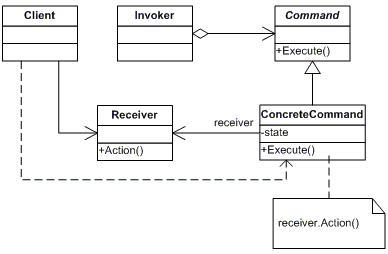

# Command

Encapsulate a request as an object, thereby letting you parameterize clients with different requests, queue or log requests, and support undoable operations.

**Frequency of Use** - 4/5

## UML Class Diagram

## Participants
The classes and objects participating in this pattern are:
- Command (Command)
  - declares an interface for executing an operation.
- ConcreteCommand (TurnOn, TurnOff, TurnUp, TurnItAllOff)
  - defines a binding between a Receiver object and an action.
  - implements Execute by invoking the corresponding operation(s) on Receiver.
- Client (Client)
  - creates a ConcreteCommand object and sets its receiver.
- Invoker (DeviceButton)
  - asks the command to carry out the request.
- Receiver (Television, Radio)
  - knows how to perform the operations associated with carrying out a request. Any class may serve as a Receiver.

## Applicability
Use the Command pattern when you want to:
- parameterize objects by an action to perform.
- specify, queue, and execute requests at different times. A Command object can have a lifetime independent of the original request.
- support undo. The Command's Execute operation can store state for reversing its effects in the command itself.
- support logging changes so that they can be reapplied in case of a system crash.
- structure a system around high-level operations built on primitive operations.

## Benefits
- **Command decouples the object that invokes the operation from the one that knows how to perform it**
- **Commands are first-class objects**. They can be manipulated and extended like any other object.
- **You can assemble commands into a composite command**.
- **It's easy to add new Commands, because you don't have to change existing classes**.
