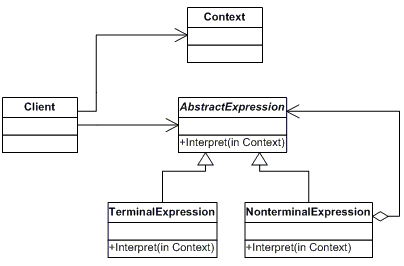

# Interpreter

Given a language, define a representation for its grammar along with an interpreter that uses the representation to interpret sentences in the language.

**Frequency of Use** - 1/5

## UML Class Diagram

## Participants
The classes and objects participating in this pattern are:
- AbstractExpression (Expression)
  - declares an abstract Interpret operation that is common to all nodes in the abstract syntax tree.
- TerminalExpression (TerminalExpression)
  - implements an Interpret operation associated with terminal symbols in the grammar.
  - an instance is required for every terminal symbol in a sentence.
- NonterminalExpression (AndExpression, OrExpression)
  - one such class is required for every rule R ::= R1 R2 ... Rn in the grammar.
  - maintains instance variables of type AbstractExpression for each of the symbols R1 through Rn.
  - implements an Interpret operation for nonterminal symbols in the grammar. Interpret typically calls itself recursively on the variables representing R1 through Rn.
- Context (None)
  - contains information that's global to the interpreter.
- Client (Client)
  - builds (or is given) an abstract syntax tree representing a particular sentence in the language that the grammar defines. The abstract syntax tree is assembled from instances of the NonterminalExpression and TerminalExpression classes.
  - invokes the Interpret operation.

## Applicability
Use the Interpreter pattern when there is a language to interpret, and you can represent statements in the language as abstract syntax trees. The Interpreter pattern works when:
- the grammar is simple.
- efficiency is not a critical concern.

## Benefits
- **It's easy to change and extend the grammar**.Because the pattern uses classes to represent grammar rules, you can use inheritance to change or extend the grammar.
- **Implementing the grammar is easy**. Classes defining nodes in the abstract syntax tree have similar implementations.
- **Adding new ways to interpret expressions**. The Interpreter pattern makes it easier to evaluate an expression in a new way.
