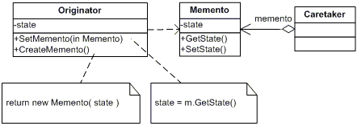

# Memento

Without violating encapsulation, capture and externalize an object's internal state so that the object can be restored to this state later.

**Frequency of Use** - 1/5

## UML Class Diagram

## Participants
The classes and objects participating in this pattern are:
- Memento (Memento)
  - stores internal state of the Originator object. The memento may store as much or as little of the originator's internal state as necessary as its originator's discretion.
  - protects against access by objects other than the originator. Mementos have effectively two interfaces. Caretakes sees a narrow interface to the Memento -- it can only pass the memento to other objects. Originator, in contrast, sees a wide interface, one that lets it access all the data necessary to restore itself to its previous state. Ideally, only the originator that produced the memento would be permitted to access the memento's internal state.
- Originator (Originator)
  - creates a memento containing a snapshot of its current internal state.
  - uses the memento to restore its internal state.
- Caretaker (Caretaker)
  - its responsible for the memento's safekeeping.
  - never operates on or examines the contents of a memento.

## Applicability
Use the Memento pattern when:
- a snapshot of (some portion of) an object's state must be saved so that it can be restored to that state later, and
- a direct interface to obtaining the state would expose implementation details and break the object's encapsulation.

## Benefits
- **Preserving encapsulation boundaries**. The pattern shields other objects from potentially complex Originator internals, thereby preserving encapsulation boundaries.
- **It simplifies Originator**. Having clients manage the state they ask for simplifies Originator and keeps clients from having to notify originators when they're done.
