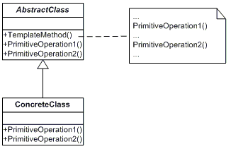

# Template Method

Define the skeleton of an algorithm in an operation, deferring some steps to subclasses. Template Method lets subclasses redefine certain steps of an algorithm without changing the algorithm's structure.

**Frequency of Use** - 3/5

## UML Class Diagram

## Participants
The classes and objects participating in this pattern are:
- AbstractClass (Sandwich)
  - defines abstract **primitive operations** that concrete subclasses define to implement steps of an algorithm.
  - implements a template method defining the skeleton of an algorithm. The template method calls primitive operations as well as operations defined in AbstractClass or those of other objects.
- ConcreteClass (ItalianSandwich, VeggieSandwich)
  - implements the primitive operations to carry out subclass-specific steps of the algorithm.

## Applicability
The Template Method pattern should be used:
- to implement the invariant parts of an algorithm once and leave it up to subclasses to implement the behaviour that can vary.
- when common behaviour among subclasses should be factored and localized in a common class to avoid code duplication.
- to control subclasses extensions. You can define a template method that calls "hook" operations at specific points, thereby permitting extensions only at those points.

## Benefits
- **Template methods are fundamental technique for code reuse**. Particularly important in class libraries, because they are the means for refactoring out common behaviour in library classes.
