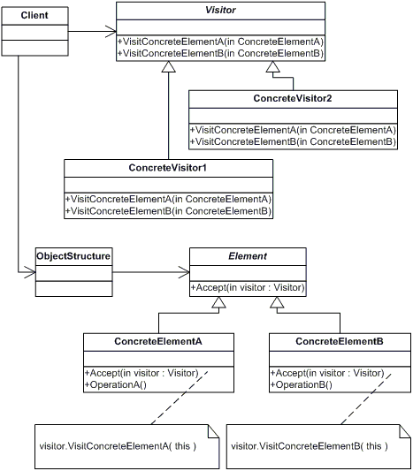

# Visitor

Represent an operation to be performed on the elements of an object structure. Visitor lets you define a new operation without changing the classes of the elements on which it operates.

**Frequency of Use** - 1/5

## UML Class Diagram

## Participants
The classes and objects participating in this pattern are:
- Visitor (ComputerPartVisitor)
  - declares a Visit operation for each class of ConcreteElement in the object structure. The operation's name and signature identifies the class that sends the Visit request to the visitor. That lets the visitor determine the concrete class of the element being visited. Then the visitor can access the element directly through its particular interface.
- ConcreteVisitor (ComputerPartDisplayVisitor)
  - implements each operation declared by Visitor. Each operation implements a fragment of the algorithm defined for the corresponding class of object in the structure. ConcreteVisitor provides the context for the algorithm and stores its local state. This state often accumulates results during the traversal of the structure.
- Element (ComputerPart)
  - defines an Accept operation that takes a visitor as an argument.
- ConcreteElement (Keyboard, Monitor, Mouse, Computer)
  - implements an Accept operation that takes a visitor as an argument.
- ObjectStructure ()
  - can enumerate its elements.
  - may provide a high-level interface to allow the visitor to visit its elements.
  - may either be a composite or a collection such as a list or a set.

## Applicability
Use the Visitor pattern when:
- an object contains many classes of objects with differing interfaces, and you want to perform operations on these objects that depend on their concrete classes.
- many distinct and unrelated operations need to be performed on objects in an object structure, and you want to avoid "polluting" their classes with these operations.
- the classes defining the object structure rarely change, but you often want to define new operations over structure.

## Benefits
- **Visitor makes adding new operations easy**. Simply add a new visitor.
- **A visitor gathers related operations and separates unrelated ones**. Related behavior isn't spread over the classes defining the object structure; it's localized in a visitor. Unrelated sets of behavior are partitioned in their own visitor subclasses.
- **Visiting across class hierarchies**. Visitors can visit objects that don't have a common parent class.
