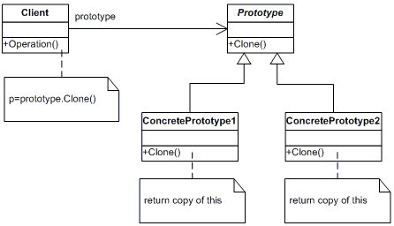

# Prototype

Specify the kinds of objects to create using a prototypical instance, and create new objects by copying data. Client asks a prototype to clone itself.

**Frequency of Use** - 3/5

## UML Class Diagram

## Participants
The classes and objects participating in this pattern are:
- Prototype (Animal)
  - declares an interface for cloning itself
- ConcretePrototype (Sheep)
  - implements an opertion for cloning itself
- Client (Client)
  - creates a new object by asking a prototype to clone itself

## Applicability
Use the prototype pattern when a system should be independent of how its products are created, composed, and represented; and:
- when the classes to instantiate are specified at run-time, for example by dynamic loading; or
- to avoid building a class hierarchy of factories that parallels the class hierarchy of products; or
- when instances of a class can have one of only a few different combinations of state. It may be more convenient to install a corresponding number of prototypes and clone them rather than instantiating the class manually

## Benefits
- **Adding and removing products at run-time**.
- **Specifying new objects by varying values**. This kind of design lets users define new "classes" without programming. The Prototype pattern can greatly reduce the number of classes a system needs.
- **Specifying new objects by varying structure**.
- **Reduced subclassing**. Prototype pattern lets you clone a prototype instead of asking a factory method to make a new object. Hence you don't need a Creator class hierarchy at all.
- **Configuring an application with classes dynamically**. Some run-time environments let you load classes into an application dynamically.
- Allows for adding of any subclass instance of a known super class at run time.
- When there are numerous potential classes that you want to only use if needed at runtime.
