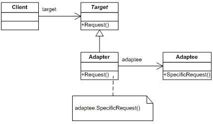

# Adapter

Convert the interface of a class into another interface clients expect. Adapter lets classes work together that couldn't otherwise because of incompatible interfaces. Allows 2 incompatible interfaces to work together.

**Frequency of Use** - 4/5

## UML Class Diagram

## Participants
The classes and objects participating in this pattern are:
- Target (RoundHole)
  - defines the domain-specific interface that Client uses.
- Client (Client)
  - collaborates with objects conforming to the Target interface.
- Adaptee (SquarePeg)
  - defines an existing interface that needs adapting.
- Adapter (SquarePegAdapter)
  - adapts the interface of Adaptee to the Target interface.

## Applicability
Use the Adapter pattern when:
- you want to use an existing class, and its interface does not match the one you need.
- you want to create a reusable class that cooperates with unrelated or unforseen classes, that is, classes don't necessarily have compatible interfaces.
- (object adapter only) you need to use several existing subclasses, but it's impractical to adapt their interface by subclassing every one. An object adapter can adapt the interface of its parent class.
