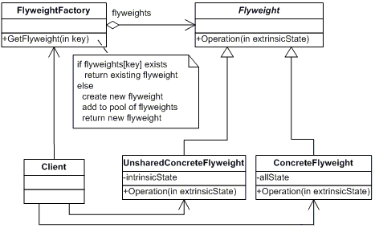

# Flyweight

Use sharing to support large number of fine-grained(similar) objects efficiently.

**Frequency of Use** - 1/5

## UML Class Diagram

## Participants
The classes and objects participating in this pattern are:
- Flyweight (Rectangle)
  - declares an interface through which flyweights can receive and act on extrinsic state.
- ConcreteFlyweight (Rectangle)
  - implements the Flyweight interface and adds storage for intrinsic state, if any. A ConcreteFlyweight object must be sharable. Any state it stores must be intrinsic; that is, it must be independent of the ConcreteFlyweight object's context.
- UnsharedConcreteFlyweight (not used)
  - not all Flyweight subclasses need to be shared. The Flyweight interface enables sharing; it doesn't enfore it. It's common for UnsharedConcreteFlyweight objects to have ConcreteFlyweight objects as children at some level in the flyweight object structure.
- FlyweightFactory (RectangleFactory)
  - creates and manages flyweight objects.
  - ensures that flyweights are shared properly. When a client requests a flyweight, the FlyweightFactory object supplies an existing instance or creates one, if none exists.
- Client (Client)
  - maintains a reference to flyweight(s).
  - computes or stores the extrinsic state of flyweight(s).

## Applicability
The Flyweight pattern's effictiveness depends heavily on how and where it's used. Apply the Flyweight pattern when all of the following are true:
- An application uses a large number of objects.
- Storage costs are high because of the sheer quantity of objects.
- Most object state can be made extrinsic(not shared).
- Many groups of objects may be replaced by relatively few shared(intrinsic) objects once extrinsic state is removed.
- The application doesn't depend on object identity. Since flyweight objects may be shared, identity tests will return true for conceptually distinct objects.

## Benefits
- **Flyweights usually reduces run-time but may introduce run-time costs associated with transferring, finding, and/or computing extrinsic state but these costs are offset by space savings**. Storage savings are a function of several factors:
  - the reduction in the total number of instances that comes from sharing
  - the amount of intrinsic state per object
  - whether extrinsic state is computed or stored.
